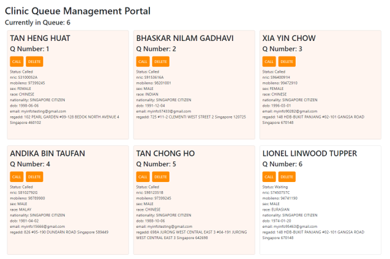
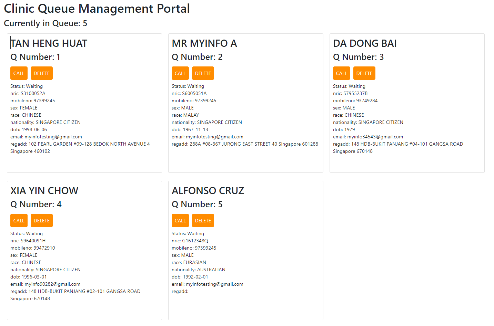

# Simulated Clinic Server



This project contains a simulated clinic server meant to operate with the [ClinicQ](https://github.com/pickledbees/clinic_q_management) application.
This clinic server is meant to simulate the queue management portal at clinics, allowing the user to call patients, as well as remove (delete) them from the
clinic queue. This simulated clinic server has been given the name "ABC Clinic".

## Using Simulated Clinic Server
Access the **demo** instance's portal [here](https://abcclinic.azurewebsites.net/). When patients are registered in the deployed demo ClinicQ application,
registration details appear as cards on the simulated clinic server portal. This server comes pre-populated with 5 personas already in queue.

 

## Deployment
This project comes included with start scripts that set the necessary environment variables for operation, as well as to start the application.
For more details on the environment variables used, see [Environment Variables](#environment-variables).

- Windows: [start.bat](start.bat)
- Linux: [start.sh](start.sh)

For **demo** purposes, an instance of ClincQ and the simulated clinic server has been publicly deployed on Azure App Service as web applications;
both projects use Github Actions to perform CD to the App Service. The workflow ```.yml``` files can be found [here](.github/workflows/main_abcclinic.yml).

## Local Development Setup
1. Set up environment variables. See [Environment Variables](#environment-variables).
2. Install [NodeJS](https://nodejs.org/en/) if not already installed. Any version >10.11.0 should work.
3. In the root directory, run ```npm install``` to install dependencies
4. Install [nodemon](https://www.npmjs.com/package/nodemon) globally: ```npm install -g nodemon```
5. Start the application in development mode: ```npm run dev```

The simulated clinic server is then deployed locally listening on port 3002 by default. On successful startup, you should see this:
```
[nodemon] starting `node app.js`
clinic system simulation listening on port 3002
```

You can now access the local portal at ```http://localhost:3002```.

## Environment Variables
The simulated clinic server uses the following environment variables in its execution.
For **deployment**, edit [start.bat](start.bat) or [start.sh](start.sh). For **development** edit [startdev.bat](startdev.sh).

| Variable                  | Description                                                                                  |
|---------------------------|----------------------------------------------------------------------------------------------|
| PORT                      | The port for the server to listen on. Not necessary for deployment in container environments |
| CLINCQ_API_CALLNUMBER     | The /callNumber API URL of the ClinicQ server                                                |
| VENUE_ID                  | The clinic's assigned SafeEntry venue ID                                                     |
| SECRET                    | The clinic's secret to call /callNumber                                                      |
| LAST_CALLED_BUFFER_LENGTH | Maximum size of recently called list                                                         |

## API
These endpoints are made available to ClinicQ to call.

### ```GET /checkStatus/<nric>/<number>```
Gets the status of the patient given the NRIC and queue number. 

Sample response (200):
```json
{
  "status": 1,
  "lastCalled": [
    {
      "number": 89,
      "time": 1628656417429
    },
    {
      "number": 101,
      "time": 1628656404064
    },
    {
      "number": 100,
      "time": 1628656355219
    }
  ]
}
```
```status```: status of the patient in the queue.
- ```0```: In queue, number not called yet.
- ```1```: In queue, number called.
- ```2```: Not in queue anymore (either completed appointment or not registered yet)

```lastCalled```: list of recently called numbers.

### ```POST /submit```
Endpoint to receive registration data submitted to ClinicQ server by patient. Returns the associated queue number.

Sample request:
```json
{
  "nric": "S3100052A",
  "name": "TAN HENG HUAT",
  "mobileno": "97399245",
  "sex": "FEMALE",
  "race": "CHINESE",
  "nationality": "SINGAPORE CITIZEN",
  "dob": "1998-06-06",
  "email": "myinfotesting@gmail.com",
  "regadd": "102 PEARL GARDEN #09-128 BEDOK NORTH AVENUE 4 Singapore 460102"
}
```
Sample Response (200):
```json
{
  "number": 89
}
```
